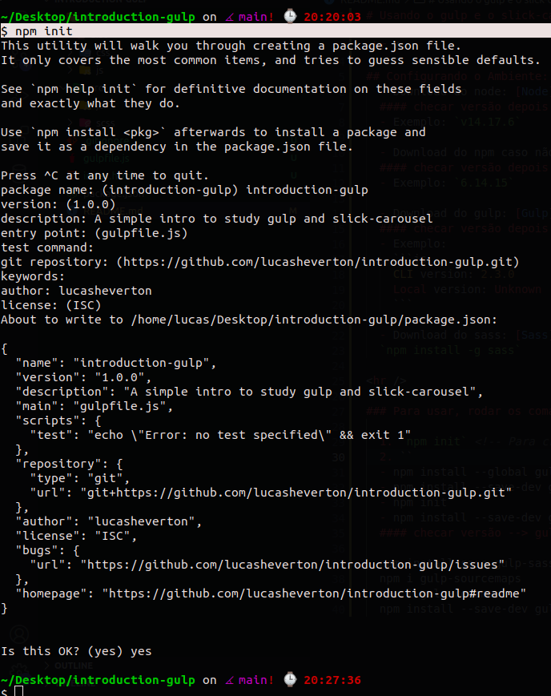
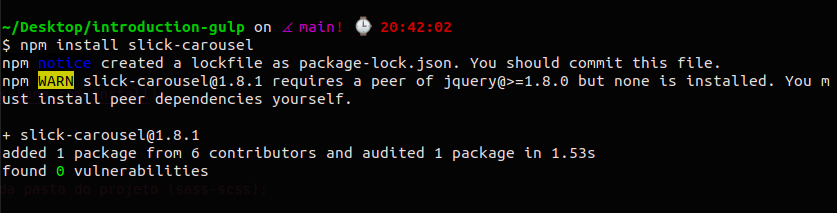

# Usando o gulp e o slick-carousel. 

## Configurando o Ambiente:
  - Download do node: [Node](https://nodejs.org/en/download/)
  #### checar versão depois de instalado --> `node --version`
  - Exemplo: `v14.17.6`

  - Download do npm caso não vier: [NPM](https://docs.npmjs.com/downloading-and-installing-node-js-and-npm)
  #### checar versão depois de instalado --> `npm --version`
  - Exemplo: `6.14.15`
    
  - Download do gulp: [Gulp](https://gulpjs.com/docs/en/getting-started/quick-start/)
  #### checar versão depois de instalado --> `gulp --version`
  - Exemplo:
    ```js 
    CLI version: 2.3.0
    Local version: Unknown
    ```

  - Download do sass: [Sass](https://sass-lang.com/install)
  `npm install -g sass`

### Para usar, rodar os comandos dentro da pasta do projeto:
  1. instalar globalmente o [gulp cli](https://gulpjs.com/docs/en/getting-started/quick-start/) 
  `npm install --global gulp-cli`

  <!-- Para criar o Package.json -->
  2. [para começar:](https://gulpjs.com/docs/en/getting-started/quick-start/) `npm init`
  

  > **logo após vai ser criado o package.json**

  3. Adicionado o Slick-carousel
  [Slick carousel](https://kenwheeler.github.io/slick/)
  [Slick carousel - github](https://github.com/kenwheeler/slick/)
  ```js
  npm install slick-carousel
  ```
  

  > **logo após vai ser criado o node_modules**

  ### Caso o node modules e o package-lock não estajam no projeto:
  - **Rodar: `npm install`**

  4. instalar o [gulp](https://gulpjs.com/docs/en/getting-started/quick-start/) no projeto
  `npm install --save-dev gulp`
  #### checar versão depois de instalado --> `gulp --version`
  - Exemplo:
    ```js 
    CLI version: 2.3.0
    Local version: 4.0.2
    ```

  5. instalar o [gulp-sass](https://www.npmjs.com/package/gulp-sass)
  `npm install sass gulp-sass --save-dev`

  6. instalar o [node-sass](https://www.npmjs.com/package/node-sass)
  `npm install node-sass`

  7. instalar o [gulp-sourcemaps](https://www.npmjs.com/package/gulp-sourcemaps)
  `npm install gulp-sourcemaps`
  
  8. instalar o [gulp-rename](https://www.npmjs.com/package/gulp-rename)
  `npm install gulp-rename`

  9. instalar o [gulp-minify](https://www.npmjs.com/package/gulp-minify)
  `npm install --save-dev gulp-minify`

  ## **Para rodar o projeto: `gulp watch`**